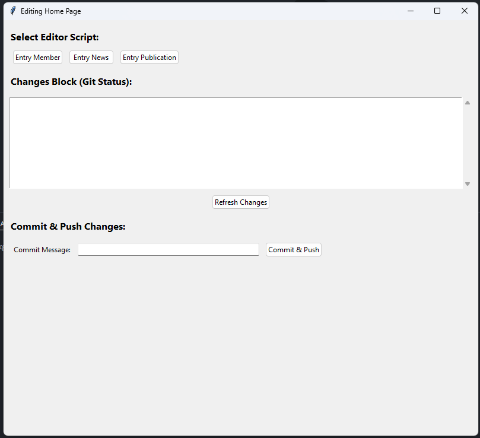
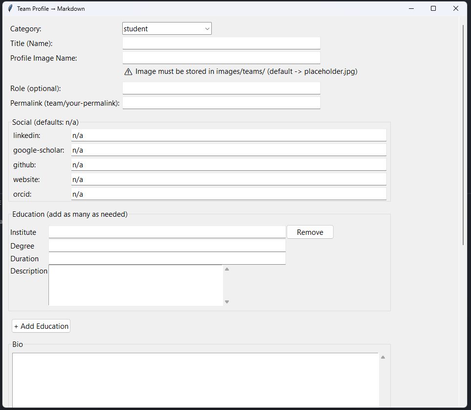
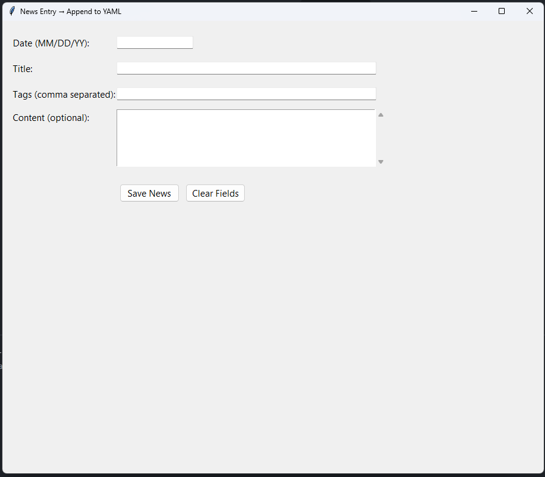
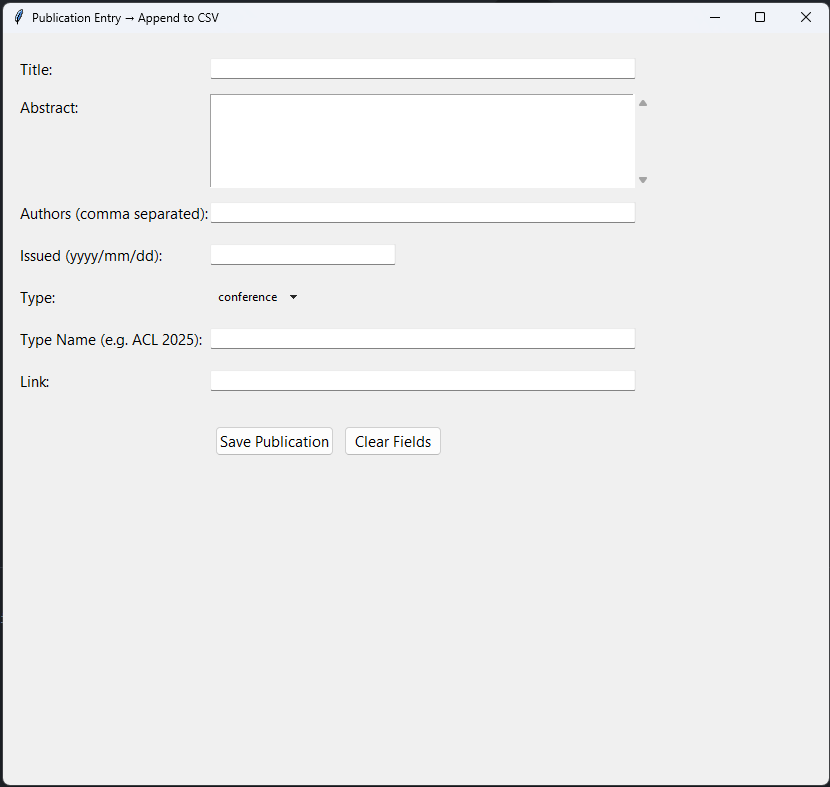

# Sanganaka - Sanskrit Computational Research Lab, IIT Kharagpur

## About Sanganaka

The Sanskrit Computational Research Lab (Sanganaka) at IIT Kharagpur advances computational linguistics for Sanskrit—one of the world’s oldest and most structured languages. Led by Prof. Pawan Goyal, the lab explores intersections of AI, classical linguistics, and Indian knowledge systems.

Guided by the motto **सा विद्या या विमुक्तये** ("That is knowledge which liberates"), Sanganaka develops scalable, linguistically informed tools such as SanskritShala and DepNeCTI to bring Sanskrit into modern computational contexts.

Research spans word segmentation, morphological analysis, syntactic parsing, prose–poetry conversion, compound structure detection, and machine translation, with a focus on integrating Paninian grammar into NLP pipelines.

Through this work, the lab bridges traditional scholarship and modern computation—reviving ancient knowledge while building a digital future for Sanskrit.

---

## Project Structure

```text

|   .gitignore
|   Gemfile
|   Gemfile.lock
|   index.html
|   README.md
|   team.html
|   _config.yml
|
+---css
|       global.css
+---data
|       news.yml
|       publication.json
|       publications.csv
|       publication_all.json
|       team.yml
+---html
|       news.html
|       publications.html
|       research.html
+---images
|   +---slider
|   +---teams
+---js
|       global.js
+---PRIVATE
|       output.csv
|       publication.json
|       publication_all.json
|       unexpected_columns.log
+---_includes
|       footer.html
|       header.html
+---_layouts
|       default.html
|       member.html
\---_team
        [Team Member Markdown Files]
```

# EDITING PAGES

| Website Page     | File to Edit           | Additional Instructions                                    |
| ---------------- | ---------------------- | ---------------------------------------------------------- |
| Home Page        | /index.html        | Contains Slider and Content.                               |
| Research Page    | /html/research.html     | Contains Content                                           |
| Publication Page | /html/publications.html | data stored in data/publications.csv                       |
| News Page        | /html/news.html         | data stored in data/news.yml                               |
| Teams Home Page  | /team.html         | data stored in data/team.yml                               |
| Member Page      | /_layouts/member.html  | individual member data stored as markdown files in /_team/ |
| Header           | /_includes/header.html | Header is universal for all pages, styles in global.css    |
| Footer           | /_includes/footer.html | Footer is universal for all pages, styles in global.css    |

# The Editor Software

The **Editing Tool** (`Editing/editor.py`) provides a graphical interface to add members, news items, and publications to the website. It automates structured edits in the relevant data files.

### Requirements
- Python 3.8 or later
- Write access to this repository (GitHub collaborator)

### How to Use
1. Clone this repository and ensure you are in the root directory.
2. Run:
   ```bash
   python Editing/editor.py
   ```

   

   You can do three additions from here:
   - Add a member
   - Add a news
   - Add a publication

⚠️ **Warning:** Check all the changes in **CHANGE BLOCK IN MAIN SCREEN OF EDITOR** before doing commit and push.

**Note:** Only authorized lab members (GitHub collaborators) can modify the site content.
The update tool simply automates structured edits in local data files.
No network access, credentials, or remote execution are involved.

## Add Member

This will assist you to create a new member markdown file and automatically push it into the teams folder as required. 

## Add News

This will assist you to add a news in the news datasource. 

## Add Publications

This will assist you to add a new publication details in the publication dataset.

## Notice

⚠️ **Confidential:** This repository is private and intended for internal use by Sanganaka lab members only. Content, code, and data must **not** be distributed, copied, or shared outside the lab without explicit permission.

---

## Acknowledgements

We gratefully acknowledge the contributions of all members of the Sanganaka lab and the support of IIT Kharagpur in advancing computational research in Sanskrit.